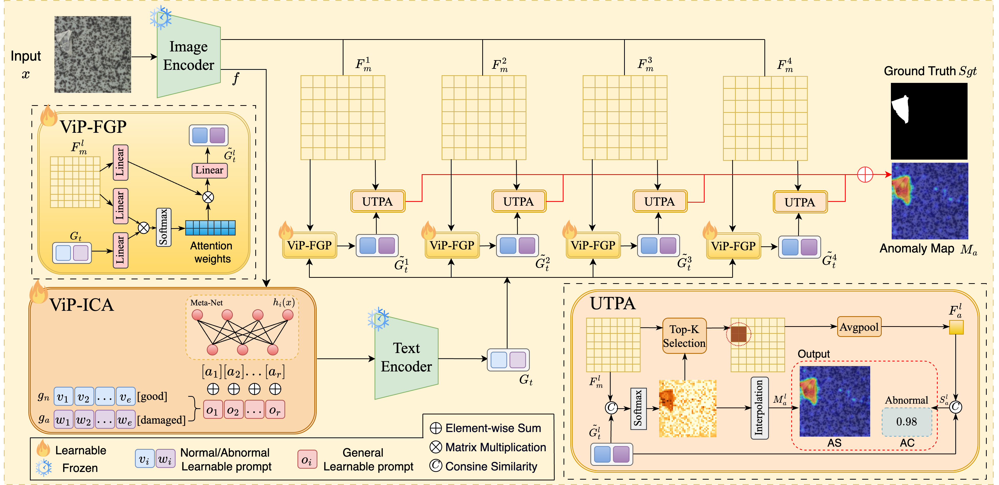
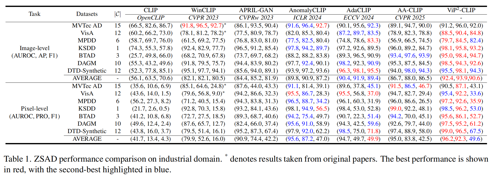
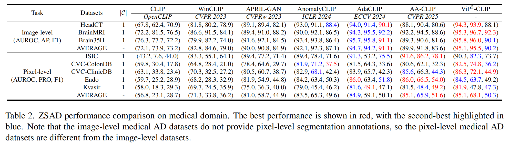
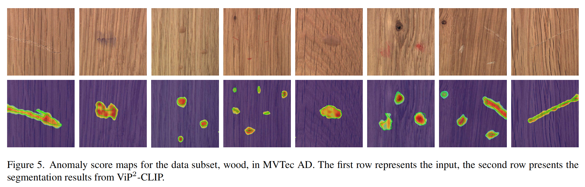
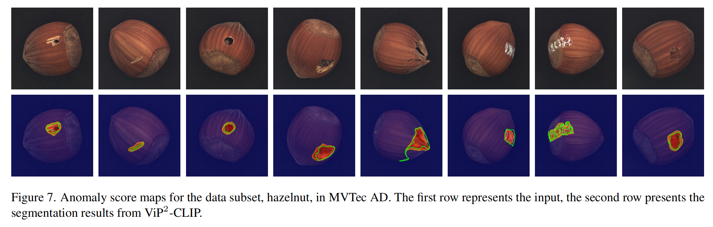
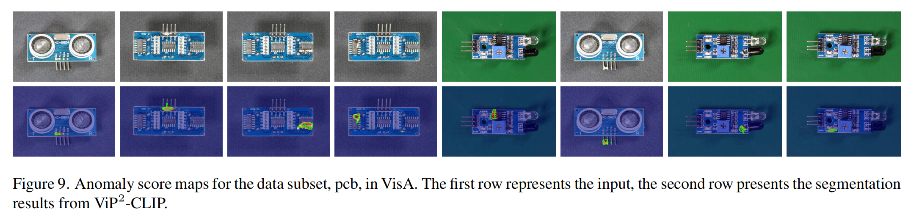
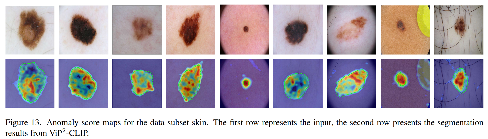
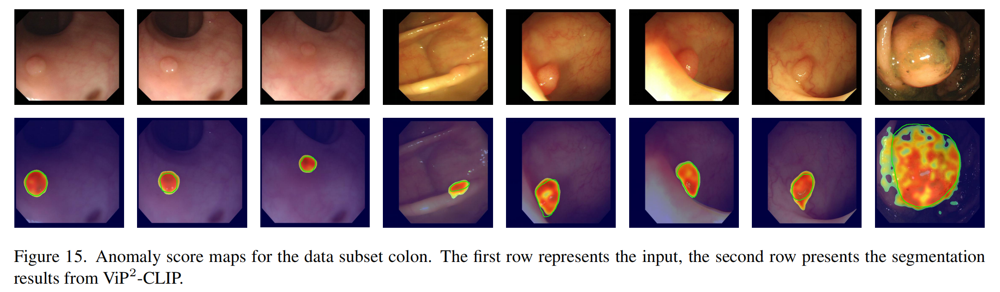

# ViP$^{2}$-CLIP
> [**ViP$^2$-CLIP: Visual-Perception Prompting with Unified Alignment for Zero-Shot Anomaly Detection**](https://arxiv.org/pdf/2505.17692v3)

## Introduction 
Zero‑shot anomaly detection (ZSAD) aims to detect anomalies without any target domain training samples, relying solely on external auxiliary data. Existing CLIP-based methods attempt to activate the model's ZSAD potential via handcrafted or static learnable prompts. The former incur high engineering costs and limited semantic coverage, whereas the latter apply identical descriptions across diverse anomaly types, thus fail to adapt to complex variations. Furthermore, since CLIP is originally pretrained on large-scale classification tasks, its anomaly segmentation quality is highly sensitive to the exact wording of class names, severely constraining prompting strategies that depend on class labels. To address these challenges, we introduce ViP$^{2}$-CLIP. The key insight of ViP$^{2}$-CLIP is a Visual‑Perception Prompting (ViP‑Prompt) mechanism, which fuses global and multi‑scale local visual context to adaptively generate fine‑grained textual prompts, eliminating manual templates and class-name priors. This design enables our model to focus on precise abnormal regions, making it particularly valuable when category labels are ambiguous or privacy-constrained. Extensive experiments on 15 industrial and medical benchmarks demonstrate that ViP$^{2}$-CLIP achieves state‑of‑the‑art performance and robust cross‑domain generalization. All experiments are implemented in PyTorch 2.6.0 on a single NVIDIA L20 (48 GB).

## Overview of ViP$^{2}$-CLIP


## QUICK START

### Prepare your dataset
Download the dataset below:

* Industrial Domain:
[MVTec](https://www.mvtec.com/company/research/datasets/mvtec-ad), [VisA](https://github.com/amazon-science/spot-diff), [MPDD](https://github.com/stepanje/MPDD), [BTAD](http://avires.dimi.uniud.it/papers/btad/btad.zip), [KSDD](https://drive.google.com/file/d/13UidsM1taqEAVV_JJTBiCV1D3KUBpmpj/view), [DAGM](https://www.kaggle.com/datasets/mhskjelvareid/dagm-2007-competition-dataset-optical-inspection), [DTD-Synthetic](https://drive.google.com/drive/folders/10OyPzvI3H6llCZBxKxFlKWt1Pw1tkMK1)

* Medical Domain:
[HeadCT](https://drive.google.com/file/d/1lSAUkgZXUFwTqyexS8km4ZZ3hW89i5aS/view?usp=sharing), [BrainMRI](https://www.kaggle.com/datasets/navoneel/brain-mri-images-for-brain-tumor-detection), [Br35H](https://www.kaggle.com/datasets/ahmedhamada0/brain-tumor-detection), [ISIC](https://drive.google.com/file/d/1UeuKgF1QYfT1jTlYHjxKB3tRjrFHfFDR/view?usp=sharing), [CVC-ColonDB](https://figshare.com/articles/figure/Polyp_DataSet_zip/21221579), [CVC-ClinicDB](https://figshare.com/articles/figure/Polyp_DataSet_zip/21221579), [Kvasir](https://figshare.com/articles/figure/Polyp_DataSet_zip/21221579), [Endo](https://drive.google.com/file/d/1LNpLkv5ZlEUzr_RPN5rdOHaqk0SkZa3m/view).


### Generate the dataset JSON
Take MVTec AD for example (With multiple anomaly categories)

Structure of MVTec Folder:
```
mvtec/
│
├── meta.json
│
├── bottle/
│   ├── ground_truth/
│   │   ├── broken_large/
│   │   │   └── 000_mask.png
|   |   |   └── ...
│   │   └── ...
│   └── test/
│       ├── broken_large/
│       │   └── 000.png
|       |   └── ...
│       └── ...
│   
└── ...
```

```bash
cd generate_dataset_json
python mvtec.py
```

Change the root to the path of your MVTec dataset. You may need to slightly adjust the code depending on the directory structure of your downloaded data. 


### Run ViP$^{2}$-CLIP

* Environment Setup

```bash
conda create -n vip2clip python=3.10 -y
conda activate vip2clip

pip install -r requirements.txt
```

* Quick start (use the pre-trained weights from models/)
We fine-tune ViP$^{2}$-CLIP on MVTec AD’s test split and evaluate ZSAD performance on all other datasets; for MVTec AD, we fine-tune on VisA’s test set.

```bash
bash test.sh
```
  
* Train your own weights
```bash
bash train.sh
```

## Main results 

### Industrial dataset
 


### Medical dataset
 


## Visualization

 

 

 

 

 

* We thank for the code repository: [open_clip](https://github.com/mlfoundations/open_clip), [AnomalyCLIP](https://github.com/zqhang/AnomalyCLIP), and [VCP-CLIP](https://github.com/xiaozhen228/VCP-CLIP).

## BibTex Citation

If you find this paper and repository useful, please cite our paper.

```
@misc{yang2025vip2clipvisualperceptionpromptingunified,
      title={ViP$^2$-CLIP: Visual-Perception Prompting with Unified Alignment for Zero-Shot Anomaly Detection}, 
      author={Ziteng Yang and Jingzehua Xu and Yanshu Li and Zepeng Li and Yeqiang Wang and Xinghui Li},
      year={2025},
      eprint={2505.17692},
      archivePrefix={arXiv},
      primaryClass={cs.CV},
      url={https://arxiv.org/abs/2505.17692}, 
}
```


